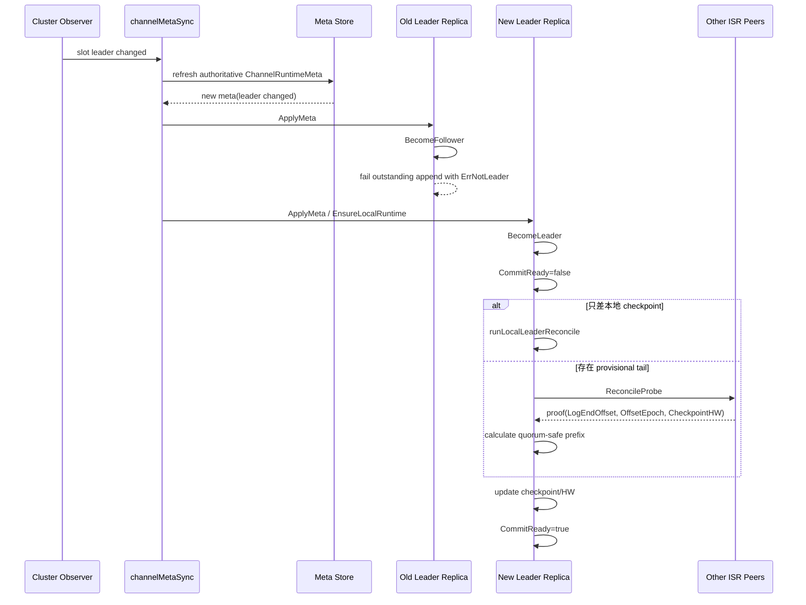

# Channel Leader Switch And Reconcile

## 一句话结论

channel 切主不是“把 leader 字段改一下”就结束了，而是要经历：

1. 发现 slot / channel leader 变化
2. 刷新权威 `ChannelRuntimeMeta`
3. 旧 leader 降为 follower
4. 新 leader 升为 leader
5. 新 leader 做 reconcile
6. `CommitReady=true` 后才重新接收写入

## 先记住两个关键点

- **切主和可写不是同一时刻**
- **新 leader 在 reconcile 完成前，append 会返回 `ErrNotReady`**

也就是说，leader 已经切过去了，不代表业务立刻就能写。

## 总体流程

```text
slot leader 变化
-> 刷新权威 channel meta
-> old leader BecomeFollower
-> new leader BecomeLeader
-> new leader 进入 CommitReady=false
-> 本地或远端 reconcile
-> CommitReady=true
-> 恢复写入
```

## 1. 谁先发现 leader 变化

当前实现里，cluster 层的 leader 变化会触发一个 observer。

之后 `channelMetaSync` 会对这个 slot 下已经激活的本地 channel 做一次刷新。

这里有两个边界要注意：

- 它只刷新 **当前节点已经激活过的本地 channel**
- 它不是全量扫描所有 channel

所以 leader 变化后的切主，是“按活跃本地 channel 增量刷新”的。

## 2. 刷新时会改哪些东西

`channelMetaSync` 刷新权威 meta 时，不只是改 `Leader`，还可能一起更新：

- `Leader`
- `LeaderEpoch`
- `Replicas`
- `ISR`
- `MinISR`
- `LeaseUntil`

如果副本拓扑也变了，那么这次刷新不仅是“切 leader”，还可能顺手把副本集合一起对齐。

## 3. 旧 leader 会发生什么

旧 leader 收到新 meta 后，本地 replica 会从 leader 切成 follower。

这个过程里会发生两件重要的事：

- 本地不再接受 append
- 已经挂起的 append 会以 `ErrNotLeader` 失败

所以旧 leader 不会继续带着旧身份写下去。

## 4. 新 leader 会发生什么

新 leader 收到新 meta 后，会进入 `BecomeLeader`。

这个阶段主要做：

- 校验新 meta
- 记录新的 epoch point
- 用当前 `LEO/HW` 初始化 progress
- 标记自己是 leader
- 开始 reconcile

但这时通常还不会马上可写。

因为只要新 leader 还不能证明自己当前日志尾部是 quorum-safe 的，它就会把 `CommitReady` 设为 `false`。

## 5. 为什么新 leader 要 reconcile

切主时最核心的问题不是“谁是 leader”，而是：

**新 leader 当前手里的日志尾巴，到底是不是安全的。**

可能出现的情况有：

- 本地尾巴已经是 quorum-safe，可以保留
- 本地只差 checkpoint 落盘，不需要问别人
- 本地尾巴只存在于旧少数派，需要截断

reconcile 的目标，就是找出真正安全的提交前缀。

## 6. reconcile 有两种路径

### 路径 A：本地 reconcile

如果新 leader 没有 `LEO > HW` 的 provisional tail，只是：

- `CheckpointHW < HW`

那么它不需要去问其他副本，直接做本地 reconcile 就够了。

这种情况通常更快。

### 路径 B：远端 proof reconcile

如果新 leader 存在：

- `LEO > HW`

那它就需要向 ISR 里的其他副本发 `ReconcileProbe`，收集：

- `OffsetEpoch`
- `LogEndOffset`
- `CheckpointHW`

然后根据这些 proof 算出 quorum-safe 的前缀。

## 7. reconcile 完成后会发生什么

reconcile 完成时，新 leader 会：

- 必要时截断不安全尾巴
- 写入新的 checkpoint
- 推进 `HW`
- 推进 `CheckpointHW`
- 把 `CommitReady` 设为 `true`

到这一步，channel 才真正恢复为“新 leader 可写”状态。

## 8. 切主时的主时序图



## 9. 切主时业务请求会看到什么

切主窗口里，业务最常见会看到三类结果：

### 在旧 leader 上写

返回：

- `ErrNotLeader`

因为旧 leader 已经降级成 follower。

### 在新 leader 上写，但 reconcile 未完成

返回：

- `ErrNotReady`

因为新 leader 还没完成 quorum-safe 收敛。

### 在新 leader 上写，且 reconcile 已完成

返回：

- append success

此时 channel 才真正完成切主。

## 10. 一个容易误解的点

很多人会把下面两件事混成一件事：

- `Leader` 已经变化
- channel 已经恢复可写

实际上它们之间隔着一个 reconcile。

所以判断“切主是否完成”，不能只看 `Leader` 字段，还要看：

- `CommitReady` 是否已经变成 `true`

## 快速记忆版

可以把“切主与收敛”记成下面这句：

```text
先刷新 meta 切角色，
旧 leader 退位，
新 leader 上位但先不可写，
确认 quorum-safe tail 后再恢复写入。
```

## 关键代码

- slot leader 变化触发刷新：`internal/app/build.go`
- active local channel 刷新：`internal/app/channelmeta_statechange.go`
- 权威 meta reconcile：`internal/app/channelmeta_lifecycle.go`
- 本地 meta apply：`internal/app/channelmeta_activate.go`
- runtime apply meta：`pkg/channel/runtime/runtime.go`
- 角色切换：`pkg/channel/replica/replica.go`
- leader reconcile：`pkg/channel/replica/reconcile.go`
- 复制与 probe：`pkg/channel/runtime/replicator.go`
